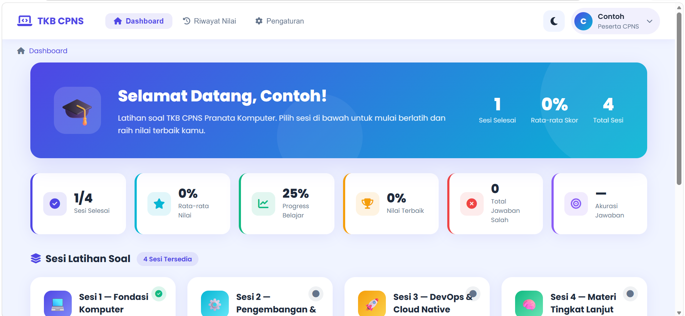
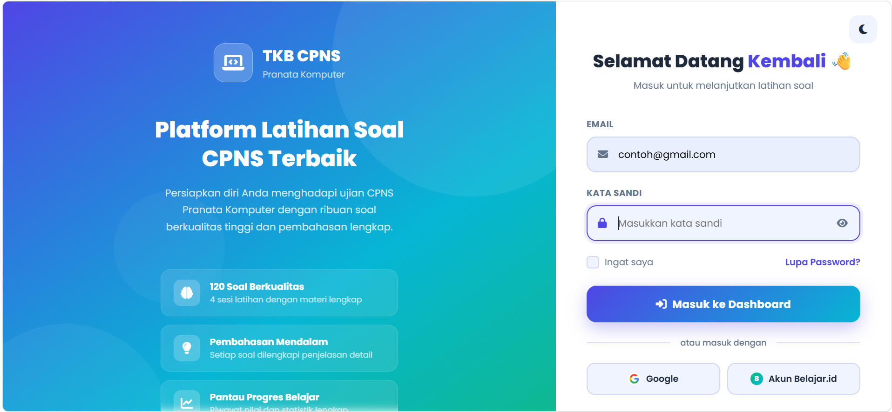
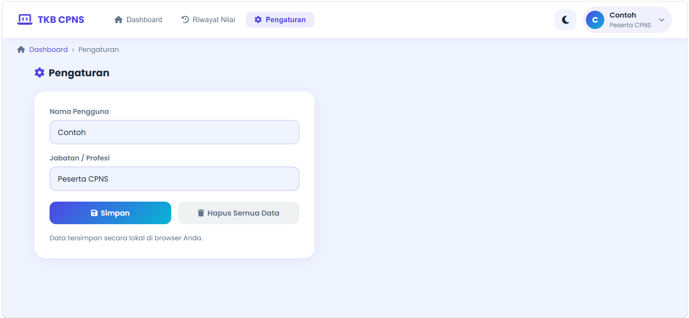
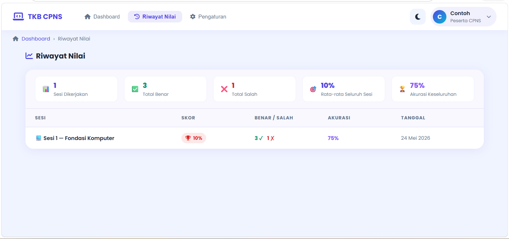
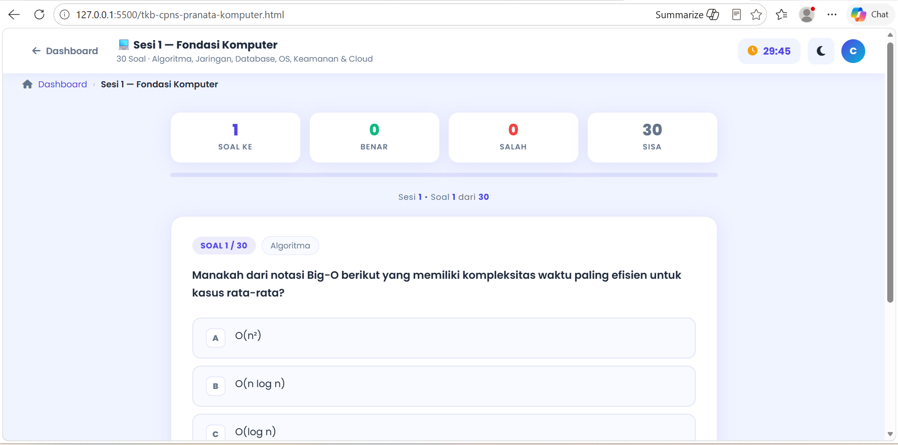

 🚀 TKB CPNS – Pranata Komputer

Website simulasi ujian TKB CPNS Pranata Komputer berbasis HTML, CSS, dan JavaScript dengan tampilan modern, responsive, dan interaktif.

 ✨ Fitur
- Dashboard modern
- Dark & Light Mode
- Multi sesi soal
- Timer ujian
- Tombol berhenti ujian
- Perhitungan soal terjawab
- Responsive design
- UI nyaman dan modern

🛠️ Teknologi
- HTML5
- CSS3
- JavaScript

📸 Preview
## 📸 Preview

### Dashboard

### Login

### Profile

### Riwayat Pengerjaan

### Soal

🚀 Cara Menjalankan
1. Download project
2. Extract file
3. Buka `index.html`

👨‍💻 Developer
Indah Purnama
